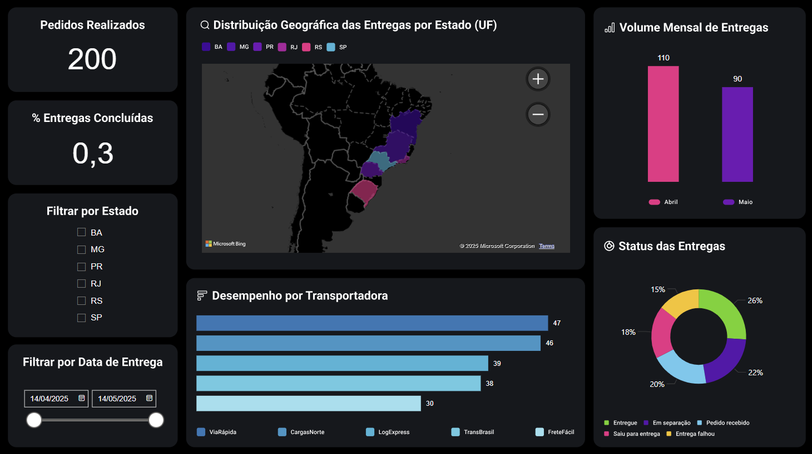

# 🚚 TrackMyDelivery – Sistema Inteligente de Rastreamento de Entregas Last Mile

**TrackMyDelivery** é um projeto completo de rastreamento de entregas last mile, combinando **Python, MySQL e Power BI** para simular um cenário real de logística.  
Foi desenvolvido com foco em **operações logísticas, análise de dados e tomada de decisão estratégica** – com aplicabilidade no setor de transporte e supply chain.

---

## 📸 Preview

---

## 🎯 Problemas que este projeto resolve

- 📍 Visualização geográfica das entregas em tempo real  
- 📊 Análise de desempenho por status e transportadora  
- ⛔ Identificação de falhas e atrasos no processo de entrega  
- 🧠 Apoio à tomada de decisão com indicadores claros  
- 🔎 Monitoramento de regiões com maior ou menor volume de entregas

---

## 🧰 Tecnologias utilizadas

| Ferramenta       | Aplicação no Projeto                                  |
|------------------|--------------------------------------------------------|
| **Python**       | Geração automatizada de dados com a biblioteca `Faker` |
| **MySQL**        | Armazenamento relacional das entregas simuladas       |
| **Power BI**     | Construção de dashboard visual e interativo           |
| **Power Query**  | Transformações de dados e limpeza                     |
| **DAX**          | Métricas personalizadas e criação de KPIs             |

---

## 📊 Visuais do Dashboard

| Visualização                   | Tipo de Gráfico       | Objetivo                                      |
|-------------------------------|------------------------|-----------------------------------------------|
| Entregas por mês              | Colunas empilhadas     | Avaliar o volume mensal e status das entregas |
| Status das entregas           | Rosca                  | Proporção por status (Entregue, Falha etc.)   |
| Entregas por transportadora   | Barras empilhadas      | Comparar desempenho entre transportadoras     |
| Mapa por UF                   | Coroplético            | Visualizar entregas por estado                |
| Cartão: Total de Pedidos      | Cartão                 | Exibir o total de pedidos geradas             |
| Cartão: % Concluídas          | Cartão                 | Percentual de entregas finalizadas com sucesso|

---

## 🎛️ Filtros disponíveis no dashboard

- **Status da entrega**
- **UF (Estado)**
- **Data da entrega**
- **Transportadora**

Essas segmentações permitem múltiplas análises e cruzamentos, facilitando diagnósticos rápidos e decisões baseadas em dados.

---

## 💡 Diferenciais

- ✅ Integração real entre backend (dados) e frontend (Power BI)
- ✅ Simulação realista com dados gerados de forma controlada
- ✅ Painel pensado para **áreas operacionais e estratégicas**
- ✅ Interface clara com foco em produtividade e ação

---

## 🚀 Possibilidades de evolução

- 🔄 Integração com APIs de rastreamento reais (Correios, Jadlog, etc.)
- ⏱️ Métricas de tempo médio de entrega
- 🔔 Alertas automáticos para entregas atrasadas
- 📱 Interface web interativa com Streamlit ou Dash
- 📦 Clusterização de regiões críticas para logística

---

## 👩‍💻 Autor(a)

**Seu Nome Aqui**  
[LinkedIn](https://www.linkedin.com/in/isatutumi) • [GitHub](https://github.com/isatutumi) 

---

## 📄 Licença

Distribuído sob a licença MIT. Sinta-se livre para usar, estudar e evoluir este projeto.

---

